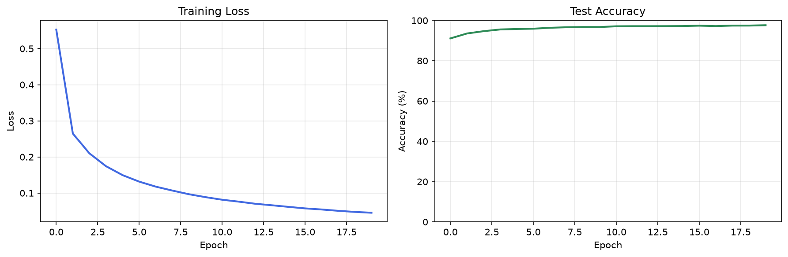
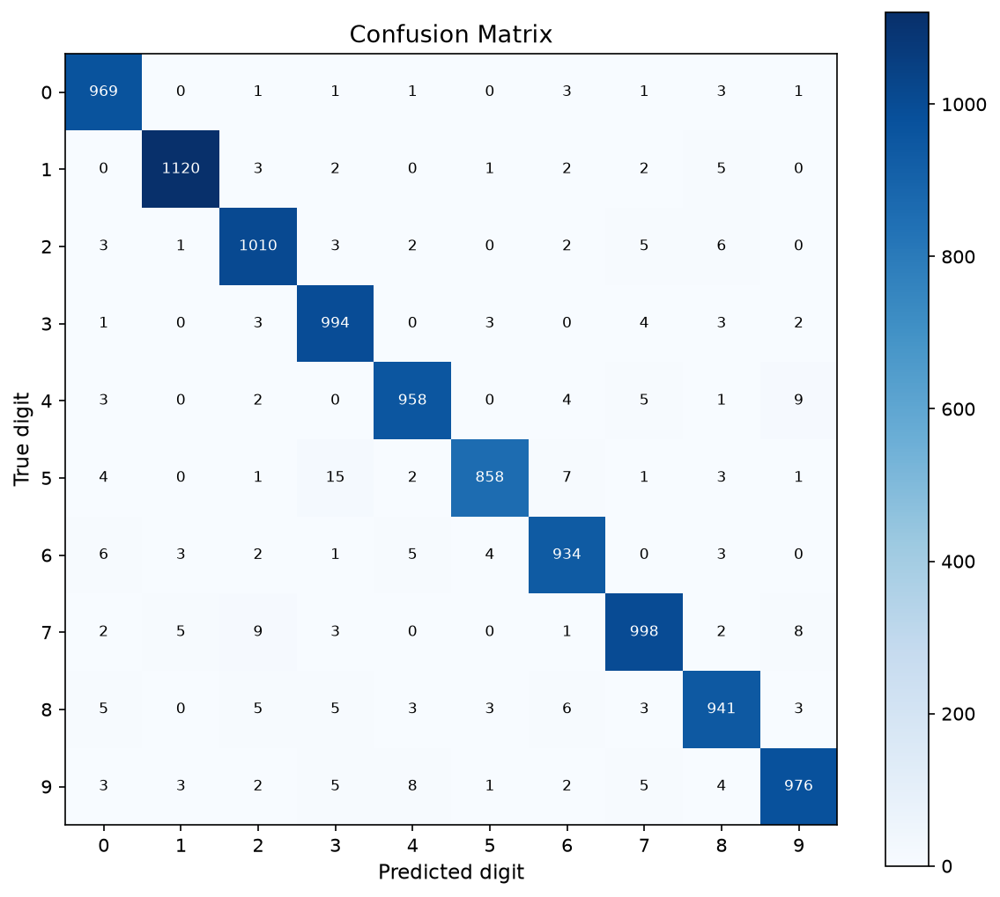
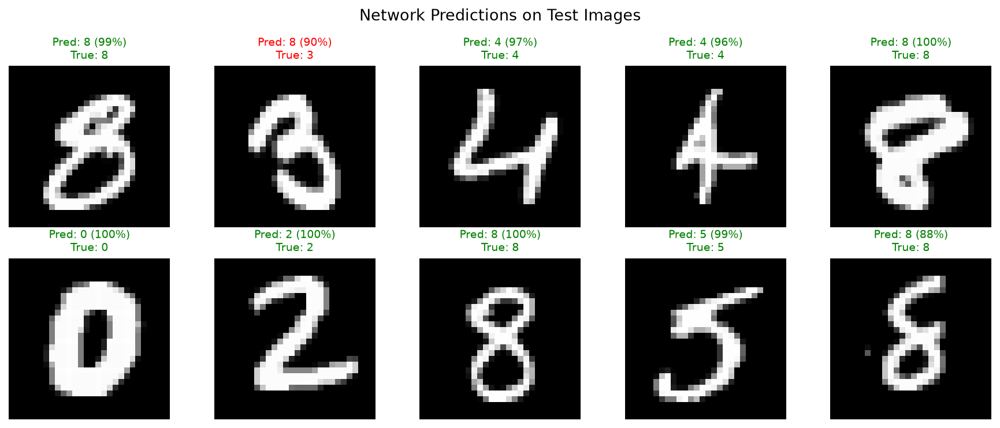
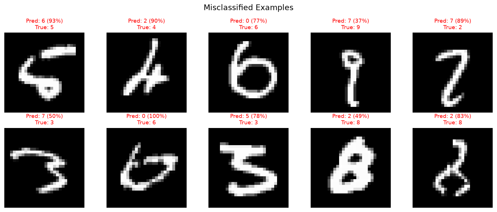

# Neural Network from Scratch (NumPy, MNIST)

Give it a picture of a handwritten digit, it tells you which number it is. Gets it
right 97.5% of the time on digits it has never seen.

No PyTorch, no TensorFlow, no scikit-learn. The forward pass, backpropagation,
gradient descent and loss function are all written directly in NumPy.

I built it this way because using a framework teaches you the API, not the maths. If
you write backprop yourself you actually have to understand where the gradients come
from.

---

## How it works

MNIST is 70,000 images of handwritten digits, each a 28x28 greyscale square. Flatten
that and you get 784 numbers per image, which is what goes into the network.

The weights start random, so at first it guesses nonsense. You show it an image, it
guesses, you tell it the correct answer, and every weight gets nudged slightly in the
direction that would have made the guess less wrong. Repeat across 60,000 images per
epoch for 20 epochs and those nudges add up into something that works.

That nudging is backpropagation, and it's the part I wrote by hand.

## Results

Final test accuracy: **97.54%**. Train accuracy ends at 98.7%, so there's about a 1.2%
gap, which is mild overfitting rather than anything to worry about.



Loss drops hard over the first few epochs then flattens. Test accuracy is already past
91% after one epoch and into the high 96s by epoch 10, so the last ten epochs only buy
about another percent.







The misclassified ones are worth a look. Most are genuinely ambiguous, the kind of
digit a person would also squint at.

## Architecture

```
784 -> 128 -> 64 -> 10
```

784 inputs (one per pixel), two hidden layers of 128 and 64 units, and 10 outputs, one
for each digit.

## Training setup

| Setting | Value |
|---|---|
| Learning rate | 0.1 |
| Epochs | 20 |
| Batch size | 256 |
| Training images | 60,000 |
| Test images | 10,000 |

## Running it

```bash
pip install numpy matplotlib
python train.py
```

MNIST downloads itself on the first run and gets cached in `data/`, so after that it
skips straight to training.

To regenerate the plots:

```bash
python visualise.py
```

## File structure

```
.
├── train.py               # Training loop, entry point
├── network.py             # Network class, weight init, prediction
├── forward.py             # Forward pass
├── backward.py            # Backpropagation and gradient computation
├── data.py                # MNIST download, parsing and batching
├── visualise.py           # Generates the plots above
└── data/                  # Cached MNIST files
```

Splitting forward and backward into separate files was deliberate. Keeping them apart
made it a lot easier to reason about the gradients while I was getting backprop
working.

## Future work

- Swapping plain gradient descent for momentum or Adam, and seeing how much faster it
  converges.
- Trying dropout to close the train/test gap.
- Extending to convolutional layers, which is a much bigger job since it means writing
  convolution and pooling from scratch too.
